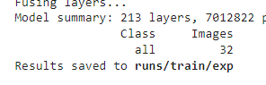

Какие рычажки подкручивать (Разметка)
==============================================

Тренировка модели
------------------

Тренировка этой модели, как и тренировка модели сегментации, происходит эпохами (однако на этот раз тестировка вынесена в отдельный блок). Количество эпох задается непосредственно при запуске обучения (блок **#23** (**YOLOv5** **YOLOv3tiny**), **#25** (**YOLOv3**)).
Пример:
::

    !python train.py --img 416 --batch 8 **--epochs 50** --data coco128.yaml --weights yolov5s.pt --nosave --cache

По умолчанию в коде стоит 50 эпох. Результат при таком количестве итераций будет иметь весьма приличное качество, однако, если остро стоит вопрос недостатка времени, количество эпох можно **снизить** до 30, а то и меньше. Однако важно понимать, что на результате это скажется.

Замена версии YOLO
-----------------------
Важно понимать, что разные версии YOLO дают разные результаты на разных датасетах, при разных промежутках времени, и имеет смысл использовать разные версии в разных случаях.
(Здесь: :ref:`` - вы можете ознакомиться с результатами, полученными нами в результате обучения трех представленных версий YOLO).

В первую очередь стоит посмотреть `официальную документацию`_ - для каждой семьи есть подробный туториал по подключению. Но ессли говорить вкратце - в рамках одной семьи, переключение от однй версии к другой сводится к подключению других весов (файла с расширением .pt):
::

    !python train.py --img 416 --batch 8 --epochs 50 --data coco128.yaml --weights **yolov3.pt** --nosave --cache

Проблемы могут возникнуть с тем, что бы подрузить эти файлы в ваш коллаб. Так, для **YOLOv5** никаких дополнительных действий не требуется, а вот для **YOLOv3** (и v3-tiny соответственно) веса необходмо подгрузить отдельной командой (**#18**):
::

    !/content/yolov3/data/scripts/download_weights.sh

Список файлов с весами любой семьи YOLO есть на ее официально гитхабе, там же обязательно будет туториал по подключению.

.. _`официальную документацию`: https://docs.ultralytics.com/

.. _savedata:

Сохранение данных
------------------------

Если вам нужны будут данные, полученные в результате обучения и/или тестирования, есть способ скачать их в формате csv: в самом конце вывода блока обучания будет указана папка, в которую будут сохранены результаты. Скорее всего это будет:

Перенести данные на гугл диск можно командой формата:
::

    !cp /content/yolov5/<указанный путь>/файл.csv <путь к файлу, по которому вы хотите его сохранить>/файл.csv

Папки test и train
--------------------

Папки test и train создаюся вами уже после запуска коллаба и используются каак хранилища изображений и аннотаций. Если по каким-то причинам, вам нужно переместить эти папки, не заудьте изменить пути в блоке **#6**:
::

    TRAIN_YOLO_DIR = '/content/train/'
    TEST_YOLO_DIR = '/content/test/'

А также изменииь содержимое файла **coco128.yaml**:
::

    train: /content/train/images  # train images (relative to 'path')
    val: /content/test/images  # val images (relative to 'path')
